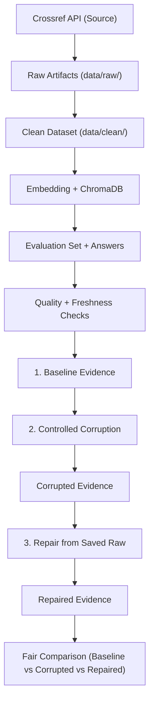

# Guide Labs — Day 10: Data Pipeline & Data Observability

> **Hướng dẫn chính (Main Guide)** cho bài lab Day 10 (Team C1 - Cohort K3).
> **Thông tin thành viên**: Nguyễn Tuấn Vũ - MSV: 2A202601845 - K3

---

## 1. Bức tranh toàn cảnh & Thuật ngữ

### Bản đồ Lab (Thời lượng: 210 phút - Trung cấp)
Trong 3.5 giờ, nhóm xây dựng một pipeline RAG hoàn chỉnh từ Crossref API, áp dụng cơ chế giám sát chất lượng dữ liệu (Data Observability), giả lập sự cố mất mát/hỏng dữ liệu để quan sát ảnh hưởng, sau đó khôi phục hệ thống từ các bản sao lưu thô (raw snapshot).

**Bài này nói về điều gì?**
- Dữ liệu lỗi (corruption) ở đầu vào sẽ trực tiếp làm sai lệch kết quả tìm kiếm và câu trả lời của RAG. Giám sát Data Quality & Freshness là chốt chặn để phát hiện sự cố trước khi người dùng nhận thấy.
- Để đo lường chính xác tác động và hiệu quả khôi phục, bộ câu hỏi đánh giá (evaluation set) phải được **cố định tuyệt đối** qua cả ba trạng thái: **Baseline**, **Corrupted**, và **Repaired**.



---

### Đích đến của bài làm (Your Finish Line)
Nhóm phải đưa ra được bằng chứng thực tế dạng JSON/Markdown để bảo vệ khẳng định:
> *Sự cố dữ liệu (Corruption) làm thay đổi các tín hiệu chất lượng/độ tươi mới (quality/freshness signals) và trực tiếp ảnh hưởng đến điểm đánh giá RAG. Khôi phục (Repair) từ snapshot dữ liệu thô đã lưu giúp phục hồi đường ống dữ liệu và cho phép đo lường sự phục hồi một cách công bằng.*

Thành công không phải là "gõ lệnh chạy không lỗi". Thành công là việc có được sự so sánh lặp lại được của 3 trạng thái **Baseline**, **Corrupted** và **Repaired** trên cùng một bộ câu hỏi đánh giá.

---

### Bảng sản phẩm nộp (Deliverables)

| STT | Sản phẩm | Ai nộp | Vị trí lưu |
| :-: | :--- | :--- | :--- |
| **1** | Toàn bộ mã nguồn hoàn thiện | Cả nhóm | các file trong `src/` |
| **2** | Bộ dữ liệu sạch, lỗi, và đã sửa | Cả nhóm | `data/clean/`, `data/raw/` |
| **3** | Bộ câu hỏi đánh giá cố định | Cả nhóm | `data/eval/test_set.json` |
| **4** | Metrics & câu trả lời của 3 trạng thái | Cả nhóm | `data/results/` |
| **5** | Các báo cáo chất lượng dữ liệu | Cả nhóm | `data/quality/` và `data/reports/` |
| **6** | Báo cáo nhóm hoàn chỉnh | Cả nhóm | `report/group_report.md` |
| **7** | Báo cáo cá nhân của mỗi thành viên | Từng người | `report/individual_[MSSV].md` |

---

### Tóm tắt Rubric chấm điểm (Tổng: 90 điểm cơ bản + 10 điểm bonus)

* **Code structure & organization (10đ)**: Chia module rõ ràng, nhất quán, không đổi contract.
* **Raw data ingestion (15đ)**: Load, parse, xử lý lỗi/retry và lưu raw response + parsed records.
* **Cleaning & data modeling (15đ)**: Quy tắc làm sạch, tính freshness, tạo `text_for_embedding`.
* **Embedding & Vector store (10đ)**: ChromaDB + MiniLM hoạt động ổn định, retrieval chính xác.
* **Agent & Multi-provider LLM (10đ)**: Tích hợp agent, cấu hình linh hoạt Gemini/OpenAI...
* **Evaluation & Scoring (10đ)**: Tạo test set hợp lệ, chấm điểm chính xác (token F1, LLM judge).
* **Data observability (10đ)**: Quality checks, freshness monitoring và runtime reports.
* **Corruption & Comparison (10đ)**: Thực hiện corruption, repair và so sánh 3 trạng thái bằng số liệu thực tế.
* **Bonus (10đ)**: Phân tích sâu, visualization đẹp, scenario corruption sáng tạo, CLI/validation bổ sung.

---

### Bảng giải thích thuật ngữ

| Thuật ngữ | Ý nghĩa trong bài Lab |
| :--- | :--- |
| **Data Pipeline** | Luồng đi của dữ liệu từ nguồn Crossref API qua các bước làm sạch, lưu trữ và RAG. |
| **Data Observability** | Khả năng theo dõi trạng thái dữ liệu (đủ không, mới không, trùng lặp không) xuyên suốt pipeline. |
| **Raw Artifacts** | Bản sao lưu response gốc từ API trước khi parse, giúp tái hiện và sửa lỗi mà không cần gọi lại API. |
| **Evaluation Set** | Tập hợp câu hỏi và câu trả lời chuẩn (ground truth) dùng để chấm điểm hệ thống RAG. |
| **Data Corruption** | Hành vi cố tình làm sai lệch dữ liệu (xóa dòng, làm stale date, xóa summary) để test sức chống chịu. |
| **Data Repair** | Khôi phục lại pipeline từ bản sao lưu thô (raw records) sau khi đã sửa các quy tắc ETL. |
| **Baseline** | Trạng thái hệ thống hoạt động với dữ liệu sạch, làm mốc để so sánh. |
| **Retrieval Hit Rate** | Đo lường xem trong top-k đoạn văn tìm được có chứa tài liệu chuẩn (ground truth ID) hay không. |

---

## 2. Setup, Phân vai & Hợp đồng dữ liệu

### Cài đặt Môi trường (Python 3.11 - 3.13)
```powershell
python --version
```

**Cách A: Dùng uv (Khuyến nghị)**
```bash
uv sync
```

**Cách B: Dùng pip thông thường (Windows PowerShell)**
```powershell
python -m venv .venv
.\.venv\Scripts\Activate.ps1
python -m pip install --upgrade pip
python -m pip install -e .
```

> **Lưu ý**: Lệnh `python -m pip install -e .` (hoặc `uv sync`) là bắt buộc để cài đặt cấu trúc package `src/` dưới dạng editable mode, giúp code nhận diện được các import chéo.

---

### Cấu hình file môi trường `.env`
Tạo file `.env` từ `.env.example`:
```powershell
cp .env.example .env
```
Cấu hình mẫu `.env`:
```dotenv
LLM_PROVIDER=gemini
LLM_MODEL=gemini-2.5-flash
GOOGLE_API_KEY=your_gemini_api_key_here
```

---

### Checkpoint C0 — Cài đặt & Liệt kê TODO
* **Nhiệm vụ**: Xác định vị trí các `TODO(student)` và `NotImplementedError` trong `src/`:
  ```powershell
  Get-ChildItem src -Recurse -Filter *.py | Select-String -Pattern 'TODO\(student\)|NotImplementedError'
  ```

---

### Checkpoint C1 — Phân chia vai trò & Hợp đồng Dữ liệu (Data Contracts)
**Bảng Hợp đồng Dữ liệu giữa các Module**:
- **Raw Schema**: JSON chứa danh sách `PaperRecord` đã parse từ API (dành cho `cleaning.py`).
- **Clean Schema**: CSV/JSON với các cột: `paper_id` (unique, non-null), `title`, `summary`, `published`, `authors_joined`, `categories_joined`, `age_days`, `text_for_embedding`, `abs_url`, `pdf_url` (dành cho `index.py`, `testset.py`).
- **Evaluation Set**: JSON chứa: `id`, `question_type`, `question`, `ground_truth`, `ground_truth_doc_ids` (dành cho RAG evaluator).

---

## 3. Thu thập & Làm sạch Dữ liệu

### Bước 1: Ingestion từ Crossref (`src/ingestion/crossref.py`)
- Calling `https://api.crossref.org/works` query paper metadata.
- Retry & backoff mechanism cho lỗi HTTP 429/503.
- Lưu trữ 2 dạng artifacts:
  - `data/raw/crossref_response.json` (Response HTTP thô)
  - `data/raw/crossref_records.json` (Flat PaperRecord list)

### Bước 2: Data Cleaning (`src/ingestion/cleaning.py`)
- Drop bản ghi rác (thiếu title, summary < 100 ký tự).
- Strip XML/HTML tags (như `<jats:p>`, `<b>`).
- Format `authors_joined`, `categories_joined`.
- Compute Freshness fields (`published` YYYY-MM-DD, `age_days`).
- Generate `text_for_embedding`: `Title: [title] | Authors: [authors] | Summary: [summary]`.
- Output: `data/clean/papers_clean.csv` & `data/clean/papers_clean.json`.

---

## 4. Đóng băng Eval Set & Retrieval (Checkpoint C2)

### Freeze Evaluation Set (`src/evaluation/testset.py`)
- Duyệt qua cleaned dataset `papers_clean.json`.
- Sinh tối thiểu 5 - 10 câu hỏi factual có ground truth và `ground_truth_doc_ids`.
- Freeze output tại `data/eval/test_set.json`.

### Checkpoint C2 Artifacts Checklist:
- [x] `data/raw/`: `crossref_response.json`, `crossref_records.json`
- [x] `data/clean/`: `papers_clean.csv`, `papers_clean.json`
- [x] `data/eval/`: `test_set.json`

---

## 5. Chạy Baseline Pipeline (Checkpoint C3)

Lập trình `src/pipelines/phase1.py` và chạy script:
```powershell
python script/run_phase1.py
```

### Artifacts sinh ra tại Phase 1 Baseline:
- `data/results/baseline_metrics.json` & `data/results/baseline_answers.json`
- `data/quality/` (Completeness, Uniqueness, Freshness PASS reports)
- `data/reports/phase1_report.md`

---

## 6. Corruption, Repair & So sánh (Checkpoint C4)

### Controlled Corruption (`src/ingestion/corruption.py`)
Tạo dữ liệu lỗi có kiểm soát trên ít nhất 3 kịch bản:
1. **Blank Summary**: Xóa summary của một số bản ghi.
2. **Stale Date**: Đổi ngày xuất bản về năm 2000 để đụng hàng Freshness Check.
3. **Duplicates**: Nhân đôi bản ghi giữ nguyên ID.
4. **Add Noise**: Chèn ký tự rác vào `text_for_embedding`.

> **Cảnh báo**: Kịch bản gây lỗi phải đụng trúng (overlap) ít nhất một tài liệu nằm trong bộ câu hỏi test `test_set.json`!

### Repair & Comparison Pipeline (`src/pipelines/corruption_flow.py`)
Chạy script điều phối:
```powershell
python script/run_corruption_flow.py
```
- Re-build index từ corrupted data $\rightarrow$ Evaluate với frozen `test_set.json`.
- Repair từ raw records `data/raw/crossref_records.json` $\rightarrow$ Re-build index $\rightarrow$ Evaluate lại.
- Báo cáo so sánh 3 cột (Baseline vs Corrupted vs Repaired) tại `data/reports/corruption_report.md`.

---

## 7. Báo cáo & Nộp bài (Checkpoint C5)

### Cấu trúc bài nộp trên GitHub:
```text
K3_Day10_TeamC1/
├── src/                      # Toàn bộ code hoàn thiện
│   ├── core/
│   ├── evaluation/
│   ├── ingestion/
│   ├── observability/
│   ├── pipelines/
│   └── retrieval/
├── data/                     # Artifacts sinh ra khi chạy
│   ├── raw/
│   ├── clean/
│   ├── eval/
│   └── results/
├── report/
│   ├── group_report.md       # Báo cáo nhóm
│   └── individual_01845_NguyenTuanVu.md # Báo cáo cá nhân Nguyễn Tuấn Vũ
├── pyproject.toml
└── script/
```

### Definition of Done Checklist:
- [ ] Baseline pipeline chạy thành công end-to-end (`script/run_phase1.py`).
- [ ] Corruption flow chạy thành công (`script/run_corruption_flow.py`).
- [ ] Cả 3 trạng thái dùng chung 1 bộ `test_set.json` frozen.
- [ ] `group_report.md` & `individual_01845_NguyenTuanVu.md` đầy đủ số liệu thực tế.
- [ ] Tuyệt đối không commit file `.env` hoặc API key.
